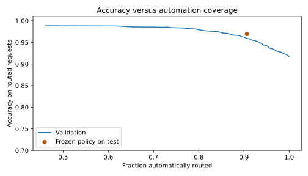

# Banking intent routing

Route a banking support request to one of 77 intents, or send it for human review
when confidence is low. This project compares TF-IDF with frozen MiniLM sentence
embeddings, trains a logistic classifier, calibrates confidence and measures the
trade-off between routing accuracy and automation coverage.

On BANKING77's official test set, the selected model reaches **93.08%
accuracy** and **0.9308 macro-F1**. A threshold chosen on validation
automatically routes **90.65%** of test requests at
**96.92% accuracy among routed requests**. The remaining 9.35%
are sent to review. This measures benchmark routing, not actual support time saved.



## Results

| Model | Test accuracy | Macro-F1 | Log loss ↓ |
|---|---:|---:|---:|
| tfidf logistic | 87.60% | 0.8758 | 0.4528 |
| minilm logistic c4 | 92.08% | 0.9207 | 0.2852 |
| minilm logistic c16 | 93.08% | 0.9308 | 0.2646 |
| minilm logistic c64 | 92.79% | 0.9278 | 0.2720 |

The chosen encoder is **frozen**, not fine-tuned. Only the classifier and
temperature parameter are fitted. CPU inference uses ONNX Runtime with masked
mean pooling and normalized 384-dimensional embeddings.

## Run it

After cloning and activating a Python 3.12 virtual environment:

```bash
python -m pip install -e .
python -m intentlab.train
python -m streamlit run app.py
```

The first run downloads the public dataset and pinned encoder weights. No GPU or
API key is needed. For REST requests, run `python -m uvicorn intentlab.api:app`
and open http://127.0.0.1:8000/docs. Example body:

```json
{"text": "My card has not arrived yet."}
```

The response includes the selected intent (null when review is required), top
three candidates, confidence, threshold, model hash and a request ID.
The demo includes a session-only review queue.

[Full setup and Docker configuration](docs/RUNBOOK.md) ·
[Analysis notebook](notebooks/analysis.ipynb) ·
[Evaluation](docs/VALIDATION.md) · [Model card](docs/MODEL_CARD.md)

## Where it fails

The deterministic typo stress test reduces overall accuracy to **80.03%**. Also,
**4 of 24** manually written unsupported/ambiguous probes are incorrectly accepted
for automatic routing. For example, “My dog is refusing to eat” is assigned to
`card_not_working` with high confidence. This is a closed-set classifier;
temperature calibration does not make it a reliable out-of-domain detector.
The probe set is small and is not an estimate of real-world error rates.

Those failures remain in the report and define the next work: collect labeled
out-of-domain and noisy-text development data, evaluate a rejection model and
test on a fresh untouched holdout. The current model is a portfolio prototype,
not an autonomous customer-service system.

Code: MIT. Dataset: CC BY 4.0. Encoder: Apache 2.0. See [provenance](DATA_CARD.md).
